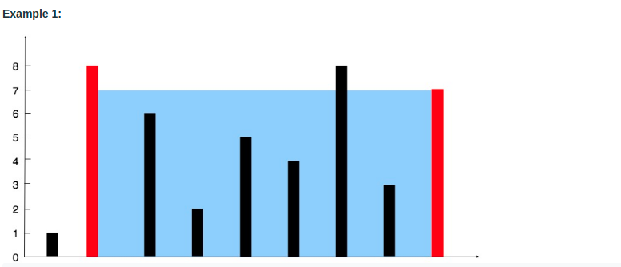

# Python Coding Problems


## move-zeros.py

```
Given an integer array nums, move all 0's to the end of it while maintaining the relative order of the non-zero elements.

Note that you must do this in-place without making a copy of the array.

 

Example 1:

Input: nums = [0,1,0,3,12]
Output: [1,3,12,0,0]
Example 2:

Input: nums = [0]
Output: [0]
 

Constraints:

1 <= nums.length <= 104
-2^31 <= nums[i] <= 2^31 - 1
 

Follow up: Could you minimize the total number of operations done?
```


## valid-mountain-arrays.py


```
Given an array of integers arr, return true if and only if it is a valid mountain array.

Recall that arr is a mountain array if and only if:

arr.length >= 3
There exists some i with 0 < i < arr.length - 1 such that:
arr[0] < arr[1] < ... < arr[i - 1] < arr[i]
arr[i] > arr[i + 1] > ... > arr[arr.length - 1]

 

Example 1:

Input: arr = [2,1]
Output: false
Example 2:

Input: arr = [3,5,5]
Output: false
Example 3:

Input: arr = [0,3,2,1]
Output: true
 

Constraints:

1 <= arr.length <= 104
0 <= arr[i] <= 104

```


## sliding-window-max-sum.py
Find the maximum sum of K consective numbers in a list


## safty-boats.py

```
You are given an array people where people[i] is the weight of the ith person, and an infinite number of boats where each boat can carry a maximum weight of limit.
 Each boat carries at most two people at the same time, provided the sum of the weight of those people is at most limit.

Return the minimum number of boats to carry every given person.

 

Example 1:

Input: people = [1,2], limit = 3
Output: 1
Explanation: 1 boat (1, 2)
Example 2:

Input: people = [3,2,2,1], limit = 3
Output: 3
Explanation: 3 boats (1, 2), (2) and (3)
Example 3:

Input: people = [3,5,3,4], limit = 5
Output: 4
Explanation: 4 boats (3), (3), (4), (5)
 

Constraints:

1 <= people.length <= 5E104
1 <= people[i] <= limit <= 3E104
```

## container-with-most-water.py



```
Given n non-negative integers a1, a2, ..., an , where each represents a point at coordinate (i, ai). n vertical lines are drawn such that the two endpoints of the line i is at (i, ai) and (i, 0). Find two lines, which, together with the x-axis forms a container, such that the container contains the most water.

Notice that you may not slant the container.

 

Example 1:


Input: height = [1,8,6,2,5,4,8,3,7]
Output: 49
Explanation: The above vertical lines are represented by array [1,8,6,2,5,4,8,3,7]. In this case, the max area of water (blue section) the container can contain is 49.
Example 2:

Input: height = [1,1]
Output: 1
Example 3:

Input: height = [4,3,2,1,4]
Output: 16
Example 4:

Input: height = [1,2,1]
Output: 2
 

Constraints:

n == height.length
2 <= n <= 105
0 <= height[i] <= 104
```


## longest-substring.py

```
3. Longest Substring Without Repeating Characters
Medium

14587

747

Add to List

Share
Given a string s, find the length of the longest substring without repeating characters.

 

Example 1:

Input: s = "abcabcbb"
Output: 3
Explanation: The answer is "abc", with the length of 3.
Example 2:

Input: s = "bbbbb"
Output: 1
Explanation: The answer is "b", with the length of 1.
Example 3:

Input: s = "pwwkew"
Output: 3
Explanation: The answer is "wke", with the length of 3.
Notice that the answer must be a substring, "pwke" is a subsequence and not a substring.
Example 4:

Input: s = ""
Output: 0
 

Constraints:

0 <= s.length <= 5 * 104
s consists of English letters, digits, symbols and spaces.
```
